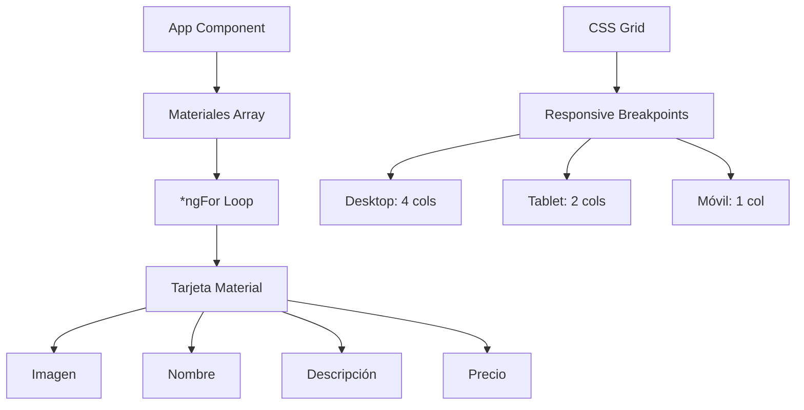

# Plan para Crear Brochure de Materiales de Carpintería en Angular

## Descripción del Proyecto
Crear una aplicación Angular que funcione como brochure informativo para materiales de carpintería, mostrando precios, imágenes y descripciones de manera estática (sin backend). El diseño debe ser moderno, minimalista y completamente responsivo.

## Estructura de Datos
Cada material tendrá:
- `name`: Nombre del material
- `description`: Descripción breve
- `price`: Precio en formato de cadena (ej: "$50.00")
- `imageUrl`: URL de la imagen (usaremos placeholders por ahora)

## Diseño y Layout
- **Layout Principal**: Contenedor principal con título y cuadrícula de tarjetas
- **Tarjetas de Materiales**: Cada tarjeta mostrará imagen, nombre, descripción y precio
- **Estilo Carpintería-Inspirado**:
  - Colores: Tonos cálidos de madera (marrón claro, beige, crema), acentos en tonos tierra
  - Tipografía: Sans-serif moderna (Inter o similar)
  - Espaciado generoso
  - Sombras sutiles para profundidad
  - Gradientes suaves para simular textura de madera
  - Fondo principal en tono beige cálido con imagen de fondo de taller de carpintería
  - Imágenes de materiales: Usar URLs en línea (Unsplash) temporalmente para visualización
- **Responsividad**:
  - Desktop: 4 columnas
  - Tablet: 2 columnas
  - Móvil: 1 columna

## Componentes Técnicos
- **Componente Principal**: `App` con datos estáticos
- **Template**: Uso de `*ngFor` para iterar sobre materiales
- **Estilos**: CSS puro con variables CSS para consistencia
- **Imágenes**: Placeholders de Unsplash o similar para materiales de carpintería

## Pasos de Implementación
1. Definir estructura de datos y datos de muestra
2. Actualizar componente TypeScript
3. Modificar template HTML
4. Implementar estilos CSS
5. Asegurar responsividad
6. Limpiar código placeholder
7. Pruebas y ajustes finales

## Ubicación de Imágenes
Coloca las imágenes de los materiales en la carpeta `src/assets/images/`. Luego, en el código, referencia las imágenes como `'assets/images/nombre-del-archivo.jpg'`.

## Datos de Muestra (Ejemplos)
- Madera de Pino: Tabla de 2x4, precio $15/m, imagen 'assets/images/madera-pino.jpg'
- Clavos: Paquete de 100, precio $5, imagen 'assets/images/clavos.jpg'
- Tornillos: Juego de tornillos para madera, precio $10, imagen 'assets/images/tornillos.jpg'
- Pegamento: Pegamento PVA, precio $8, imagen 'assets/images/pegamento.jpg'
- Barniz: Barniz transparente, precio $12, imagen 'assets/images/barniz.jpg'
- Sierra: Sierra manual, precio $25, imagen 'assets/images/sierra.jpg'
- Lija: Papel de lija grano 120, precio $3, imagen 'assets/images/lija.jpg'
- Martillo: Martillo de carpintero, precio $20, imagen 'assets/images/martillo.jpg'

## Diagrama de Flujo (Mermaid)

¿Estás de acuerdo con este plan? ¿Quieres hacer algún cambio o agregar más detalles?